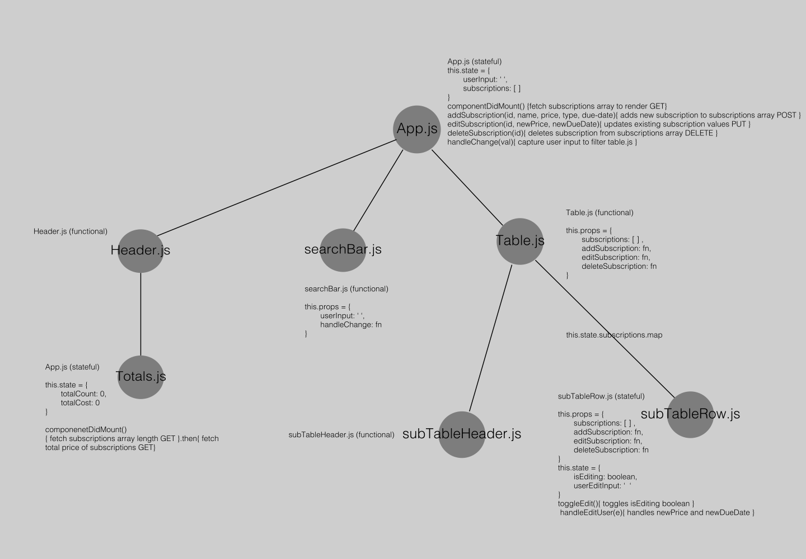
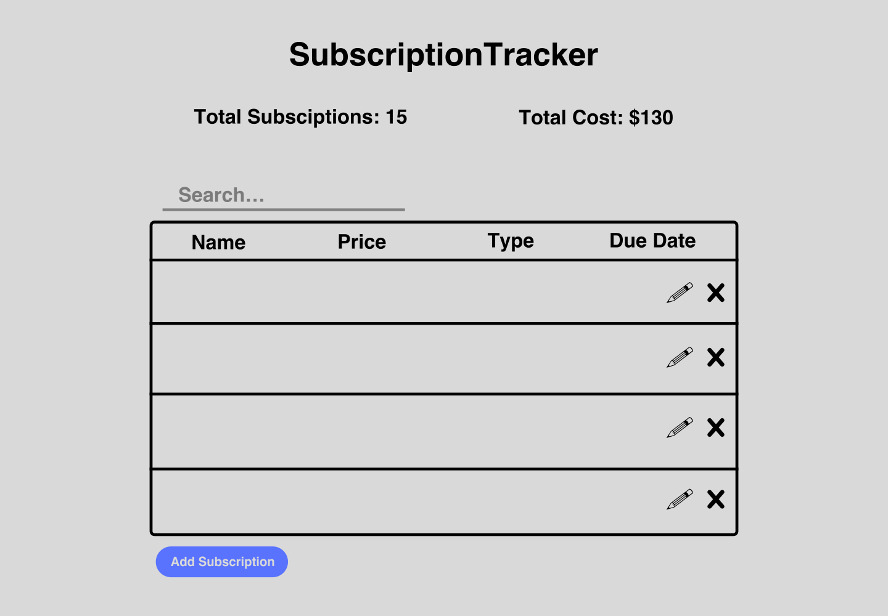

# Subscription Tracker App 

## Application Concept and Wireframe

### Application Concept:
- This is an app to store and update your current monthly subscription services (Spotify, Netflix, etc...)
- Full CRUD: 
    - GET: Get all stored subscriptions 
    - POST: Create new subscriptions to add to the subscription array 
    - PUT: Update the current subscriptions on the subscription array 
    - DELETE: Remove subscriptions from the subscription array 

### Functionality 
- We want a header at the top of the page to display the name of the app, the current amount of total subscriptions, and the total cost of all the subscriptions
- We want to display the subscriptions array when the app loads in a clear table format: 
    - The subscriptions array will display the name of the service
    - The subscriptions array will display the price of the service 
    - The subscriptions array will display the type of service
    - The subscriptions array will display the due date for payment of the service 
- Once a new subscription is created we will push that to the subscriptions array 
- We want to be able to delete a subscription service from the subscriptions array 

### Endpoints 
- GET: Get total number of stored object in subscription array to display in header 
- GET: Fetch all stored subscriptions in the array to make our table component 
- POST: push newly created subscription to table component 
- PUT: update the current subscription services in our table component 
- DELETE: delete subscription from the table component 

### Component Architecture 
- App.js (stateful: userInput, subArray)
    - Header.js (functional)
        - Totals.js (stateful: subscriptions total count, subscriptions total cost)
    - searchBar.js (functional)
    - Table.js (functional)
        - subTableHeader.js (functional)
        - subTableRow.js (functional)
        
### Wireframe 

